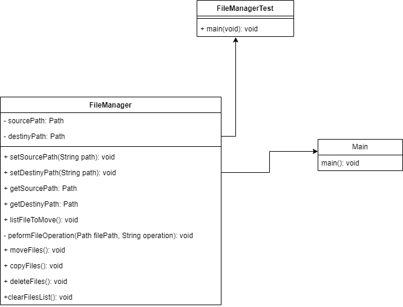
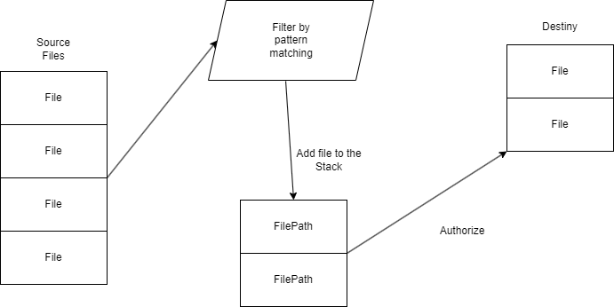

# File Handler Project

This project is a simple file manager that moves your file from a source to a destiny given the pattern matching for example to move all files on a folder that contains the extension .csv you can specify it as follows. 
1- Source path: "C:\\Users\\Brandon\Downloads"
2- Pattern: "^.*\.csv$"
2- Destiny path:  "C:\\Users\\Brandon\Desktop"

### Project purpose
This is a simple Java project that contains testing without using third party libraries like Junit, the purpose of this project is to show basic knowledge of Java like UML, Objects, Iterators, Streams.

Some of the other purposes of this project are the way of how to structure Java project and the implementation of some basic patterns like interfaces with error handling to make the project more escalable and maintainable.

### Diagrams

#### UML

### Process design

